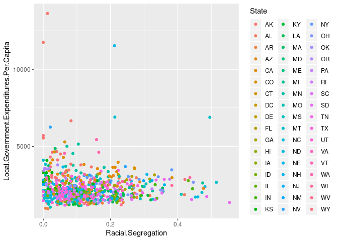
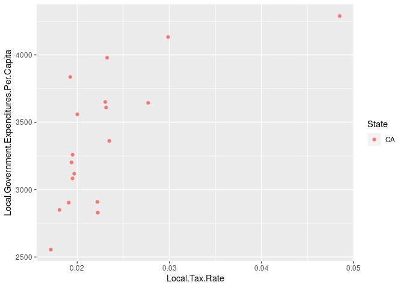
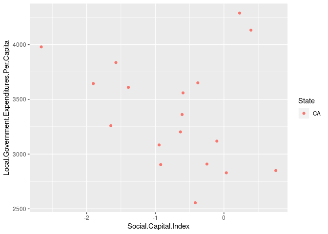

Final Project
================
Timothy Hanneman

    Parsed with column specification:
    cols(
      CZ.Name = col_character(),
      State = col_character(),
      Racial.Segregation = col_double(),
      Income.Segregation = col_double(),
      Household.Income.per.capita = col_double(),
      Local.Tax.Rate = col_double(),
      Local.Government.Expenditures.Per.Capita = col_double(),
      Labor.Force.Participation.Rate = col_double(),
      Social.Capital.Index = col_double(),
      Fraction.Religious = col_double()
    )

## Introduction

Description of data and problem(s) you are solving. Include data
source(s) here, either through citation or link to webpage.

The original data set came from a scientific investigation of social
mobility among children. It measured a large number of characteristics
of neighborhoods and differences in outcomes using children who changed
neighborhoods as a control. I thought it would be interesting to plot
some of the data as a simple investigation of how different factors
might related to each other. The project can be found at
<https://opportunityinsights.org/data/>. The dataset is named “Where is
the Land of Opportunity? The Geography of Intergenerational Mobility in
the United States.” I learned about the dataset from
<http://freakonomics.com/podcast/american-dream-really-dead/> . It also
includes an online lecture that has been used at Stanford & Harvard for
using stats & data for economic and social problems.

## Graphic 1

The goal is data exploration.

Does the plot of racial segregation show any relation into local
government expenditures per capita? The graph is of multiple localities
within each of the 50 states. For further investigation it would be
interesting to see if the various states could be grouped into larger
geographical gropus to see if there are any differences by region. I
wouldn’t make any conclusions based just on these graphs without trying
to control for other factors.

    Warning: Removed 2 rows containing missing values (geom_point).

<!-- -->

## Graphic 2 - (Extra investigation)

Lets examine something that seems more likely to be related,
expenditures and tax rate. Let look at a few of the places in California
since this is where we are at.

<!-- -->

## Graphic 3 - (Extra investigation)

Lets take a look at social capital defined by google as “the networks of
relationships among people who live and work in a particular society,
enabling that society to function effectively.”. Is there any
relationship between Social Capital and Government expenditures?

<!-- -->
